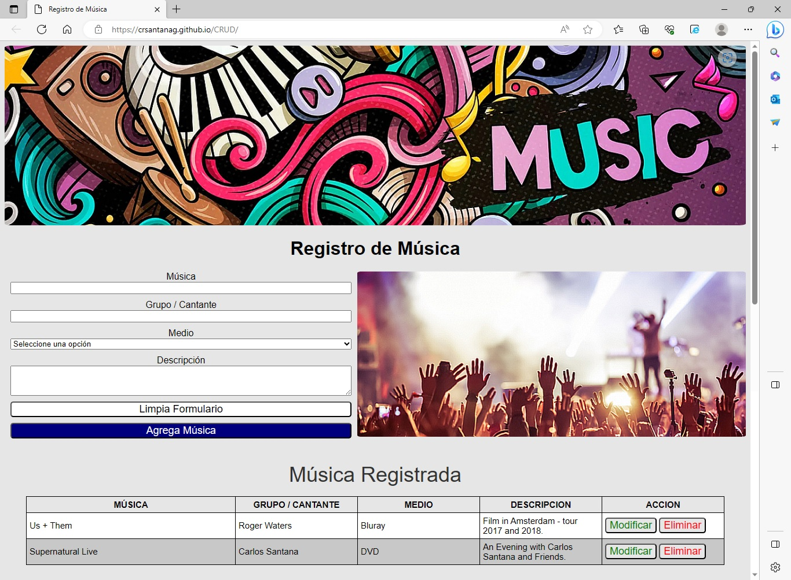

# Registro de Música

CRUD con HTML, CSS y JavaScript

## Descripción

Este proyecto permite llevar un registro de la música del usuario, pudiendo crear, modificar y eliminar cada uno de éstos. Está desarrollado utilizando HTML, CSS y JavaScript con el uso del DOM y Local Storage para almacenar los datos de la música.

## Insignias


## Visuals



## Inicio

Estas instrucciones te ayudarán a obtener una copia del proyecto y a ejecutarlo en tu máquina local para fines de desarrollo y prueba.

### Pre-requisitos

No se requieren instalaciones adicionales para ejecutar este proyecto, solo necesitarás un navegador web actualizado.

### Instalación

Sigue estos pasos para ejecutar el proyecto localmente:

1. Clona este repositorio en tu máquina local.

```bash
git clone https://github.com/crsantanag/CRUD.git
```

1. Navega hasta el directorio del proyecto.

```bash
cd CRUD
```

1. Abre el archivo `index.html` en tu navegador web.

## Ejecutando las pruebas

Este proyecto no cuenta con pruebas automatizadas. Sin embargo, puedes probar manualmente todas las funcionalidades del gestor de tareas.

### Analizar pruebas de extremo a extremo

Puedes verificar que las tareas se creen correctamente, se puedan marcar como completadas y eliminarlas adecuadamente.

### Pruebas de estilo de codificación 

Asegúrate de mantener un código limpio y bien estructurado siguiendo las mejores prácticas de HTML, CSS y JavaScript.

## Implementación

Puedes implementar este proyecto en un servidor web o utilizarlo localmente sin necesidad de implementación adicional.

## Construido con

Herramientas utilizadas para crear el proyecto:

* HTML - Estructura del sitio web.
* CSS - Estilos y diseño visual.
* JavaScript - Lógica y funcionalidad del gestor de tareas.
* DOM - Manipulación del árbol de objetos del documento.
* Local Storage - Almacenamiento de datos en el navegador.

## Contribuir

Este proyecto es de código abierto y las contribuciones son bienvenidas. Puedes colaborar mejorando el diseño, agregando nuevas funcionalidades o corrigiendo errores. ¡Siéntete libre de enviar tus pull requests!

## Licencia

Este proyecto está bajo la Licencia MIT. Consulta el archivo [LICENSE.md](LICENSE.md) para obtener más detalles.

## Expresiones de gratitud

Este archivo readme se ha desarrollado utilizando como referencia los siguientes proyectos:

* [template-readme-es](https://github.com/brayandiazc/template-readme-es) - creado por [Brayan Diaz C](https://github.com/brayandiazc)

---
⌨ ️Carlos Santana (https://github.com/crsantanag)
